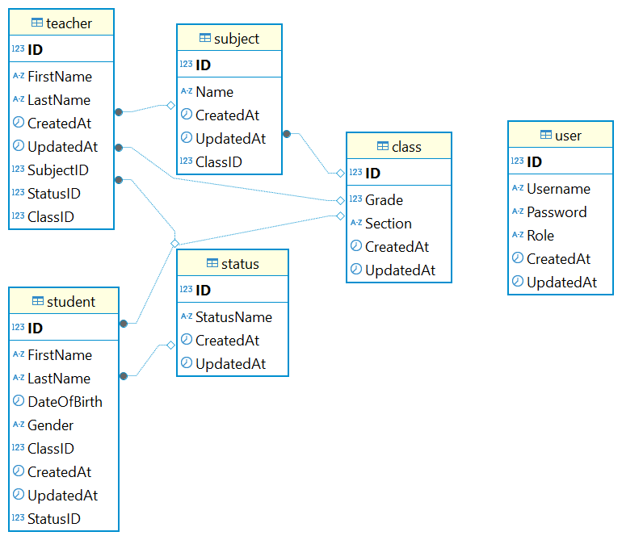

# School Management Application (NestJS + React + Vite + Material UI)

## 🔧 Project Setup

### 📁 Backend (NestJS)

```bash
cd backend
npm install
npm run start:dev
```

### ⚛️ Frontend (React + Vite + MUI)

```bash
cd frontend
npm install
npm run dev
```

## ERD Schema Diagram
`school_management_schema` diagram.
